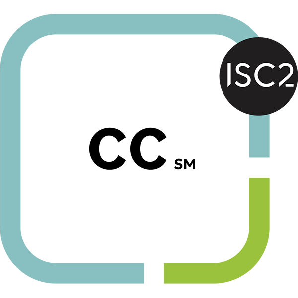
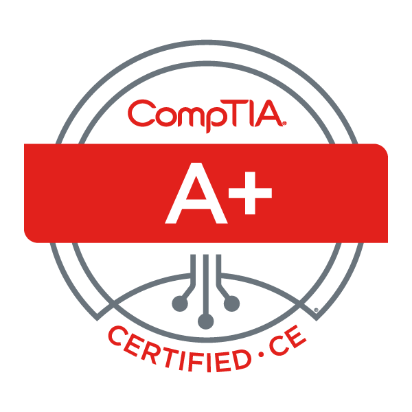

# Hello, I'm Dennis!

I am PLC/SCADA Programmer with a passion . I have been programming PLCs for 5 years and SCADA systems for 2. I have worked mostly in the water/wastewater and robotics industries on both the design and commissioning side as well as the maintenance side.

## Objective

After being exposed to what Operational Technology (OT) is I have developed a passion to learn OT networking and security principles. I am currently pursuing my bachelor's degree in Cybersecurity and Information Assurance on my personal time, and through my employer taking professional development opportunities to learn OT principles. My goal is to develop into an OT security professional.
<!--
## Skills
[Provide skills and associated project. Make sure to hyperlink the project - Remove this afterwards]]

| Skill                                         | Associated Project         |
|-----------------------------------------------|----------------------------|
| SIEM Implementation and Log Analysis          | <a href="https://google.com">Detection Lab</a>|
| Network Traffic Monitoring and Attack Detection | <a href="https://google.com">Detection Lab</a>|
| Security Automation with Shuffle SOAR         | SOC Automation Lab|
| Incident Response Planning and Execution      | SOC Automation Lab|
| Case Management with TheHive                  | SOC Automation Lab|
| Scripting and Automation for Threat Mitigation | SOC Automation Lab|

## Tools
[Provide tools and break them down into categories. Use ChatGPT to help create the link - Remove this afterwards]]

### Network

    
    
    

### Endpoint

    
    

### SIEM

    
    
    
</iv>
-->
## Certifications

<!--
## Projects
- Detection Lab
- SOC Automation Project
-->
